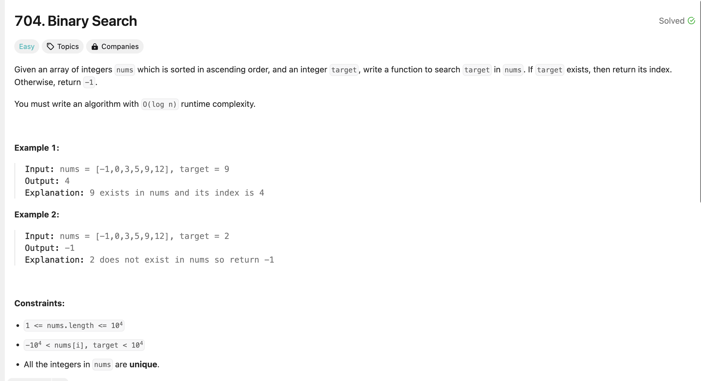

# 概述

刷题第一天，题目是做过的数组相关的题目，主要是二分搜索和双指针。

复习了二分搜索，做题尝试了左开右开、左开右闭的2种写法，复习了两种写法的差异。

复习了双指针法，写了2道easy题。

## Binary Search

### [LC. 704](https://leetcode.com/problems/binary-search/description/)

 as the nums array is already in ascending order, we can allpy binary search with TC = O(log n)

if it's not in order, need to travel through all elements so that TS is O(n)

### [LC. 34](https://leetcode.com/problems/find-first-and-last-position-of-element-in-sorted-array/)

Also apply binary search, split find start index and end index into two functions, when find an equal number, record it index and half the search space.

### [LC. 35](https://leetcode.com/problems/search-insert-position/)

easy one,  binary search to find the insert position in sorted array, insert position should be right after the first element that's lower than target.

if the number already exist in the nuts array, left pointer will points to it, insert at this position is find.

add a first check in first and last element to find if it should be insert in front of head or push at tail, to avoid unnecessary BS at first.

## Two Pointers

### [LC. 27](https://leetcode.com/problems/remove-element/description/)

brute force: **TC = O(n^2), SC = O(1)**; iterate all num in nums, when at idx meet nums[idx] eql val, move elements to the right of idx left forward 1 step to 'erase' current element. 

after that, continue check if nums[idx] eql val again;

need use a counter variable to record how many number eql val in nums, then nums.length - count is the number of element that not eql val

Then two pointers,  **TC = O(n), SC = O(1)**; fast pointer iterate through all elements in nums, slow pointer only move forward and record the value into current index when find some one not equal to val.

### [LC. 977](https://leetcode.com/problems/squares-of-a-sorted-array/description/)

same two pointers way, find the greater square and push into array, but need to reverse before return.